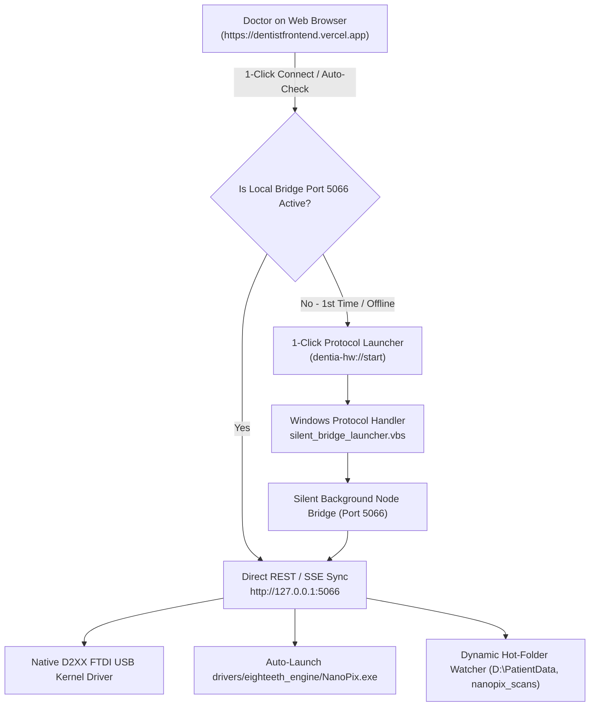

# 🦷 Dentia Medical Hardware Auto-Run & Cloud-to-Desktop Sync Architecture

> **Target Environments:**
> - 🌐 **Production / Cloud:** `https://dentistfrontend.vercel.app/`
> - 💻 **Local Development:** `http://localhost:5173/`
> - 🔌 **Hardware Interface:** Eighteeth Nano-Pix 1 & 2 Digital RVG Sensor (`FTDI FT232H VID: 0x0403, PID: 0x6014`)

---

## 📌 1. The Core Challenge: Web Browser Security vs. Local Hardware

Modern browsers (Google Chrome, Microsoft Edge, Brave, Safari) execute web applications inside a **secure sandbox**:
1. A website running in the cloud (`https://dentistfrontend.vercel.app/`) is **strictly prohibited by browser security** from directly executing `.bat`, `.exe`, or `.cjs` files on a visitor's desktop without user permission or a local agent.
2. Browsers block cloud websites from connecting to local ports (Mixed Content / Private Network Access) unless **Insecure Content** is set to **Allow** in Site Settings.

To achieve a **100% seamless, zero-terminal experience** for doctors (identical to Zoom, Slack, DEXIS, and Carestream Dental), Dentia implements the **3-Tier Medical Hardware Architecture**.

---

## ⚡ 2. The 3-Tier Medical Hardware Architecture



---

## 🚀 3. How Doctors Auto-Run the Hardware (Zero Terminal)

### 🥇 Method 1: Permanent Auto-Start on Windows Boot (Recommended for Clinics)
Doctors run this file **once** on each surgery room PC:

1. Double-click:
   ```cmd
   REGISTER_DENTIA_PROTOCOL.bat
   ```
2. **What this does automatically in the background:**
   - Registers the `dentia-hw://` browser protocol in Windows.
   - Places `DentiaNanoPixBridge.vbs` in the Windows Startup folder (`%APPDATA%\Microsoft\Windows\Start Menu\Programs\Startup`).
   - Starts `nanopix_usb_bridge.cjs` and arms the sensor on Port `5066` silently in the background.
3. Whenever the clinic computer turns on, the Dentia hardware agent is **already running**.
4. The doctor opens `https://dentistfrontend.vercel.app/`, and the sensor status immediately turns **🟢 Green (Armed & Connected)**.

---

### 🥈 Method 2: 1-Click Browser Protocol Launch (`dentia-hw://start`)
If the service was closed or stopped:
1. The doctor opens `https://dentistfrontend.vercel.app/` and clicks the **Hardware Badge** or **Capture Intraoral X-Ray**.
2. If the bridge is not active, a prompt appears with a single button:
   > **⚡ Launch Hardware Agent Now**
3. The browser triggers `dentia-hw://start`, launching the bridge and `drivers\eighteeth_engine\NanoPix.exe` with zero command prompt windows.

---

### 🥉 Method 3: Direct Session Batch File (Manual Dev / Clinic Fallback)
For debugging or portable USB drive setups:
- Double-click:
  ```cmd
  START_NANOPIX_AUTO_SYNC.bat
  ```

---

### 🔄 Method 4: Clean Uninstall & Reinstallation
If the service is already installed, or if you changed directories and want to perform a 100% clean uninstall and fresh reinstallation:

- **To Cleanly Uninstall:**
  ```cmd
  UNINSTALL_DENTIA_PROTOCOL.bat
  ```
  *(Stops all running background bridge and hardware processes, removes the Windows Startup launcher, removes registry keys, and releases Port 5066).*

- **To Perform a Clean Reinstall (1-Click):**
  ```cmd
  REINSTALL_DENTIA_PROTOCOL.bat
  ```
  *(Automatically runs clean uninstallation first, then sets up fresh silent startup, registers the protocol, and boots the bridge).*

---

## 🔒 4. Cloud (Vercel HTTPS) Prerequisites

When using `https://dentistfrontend.vercel.app/`:

1. **Browser Site Settings:**
   - In Chrome / Edge address bar, click the **Tune / Lock icon** 🎛️ ➔ **Site settings**.
   - Set **Insecure content** to **Allow** (allows HTTPS Vercel to communicate with local bridge on `http://127.0.0.1:5066`).
   - Set **Microphone** to **Allow** (for AI voice clinical notes).
2. **Sensor Hardware:**
   - Ensure the Eighteeth Nano-Pix sensor USB cable is plugged into a USB port.
3. **Automatic Engine Discovery:**
   - The bridge automatically finds and launches the bundled engine at:
     ```
     drivers\eighteeth_engine\NanoPix.exe
     ```

---

## 🛠️ 5. Key Architecture Files in this Repository

| File | Purpose |
| :--- | :--- |
| [`REGISTER_DENTIA_PROTOCOL.bat`](file:///d:/dentistfrontend/Dentistfrontend/REGISTER_DENTIA_PROTOCOL.bat) | 1-Click installer registering `dentia-hw://` and Windows startup service |
| [`UNINSTALL_DENTIA_PROTOCOL.bat`](file:///d:/dentistfrontend/Dentistfrontend/UNINSTALL_DENTIA_PROTOCOL.bat) | Clean uninstaller removing registry keys, startup scripts, and stopping background bridge |
| [`REINSTALL_DENTIA_PROTOCOL.bat`](file:///d:/dentistfrontend/Dentistfrontend/REINSTALL_DENTIA_PROTOCOL.bat) | Complete clean uninstall + fresh reinstall script |
| [`START_NANOPIX_AUTO_SYNC.bat`](file:///d:/dentistfrontend/Dentistfrontend/START_NANOPIX_AUTO_SYNC.bat) | Session launcher that starts the NanoPix UI and the hardware bridge |
| [`nanopix_usb_bridge.cjs`](file:///d:/dentistfrontend/Dentistfrontend/nanopix_usb_bridge.cjs) | Local HTTP & SSE server on port `5066`, D2XX kernel driver binding, hot-folder watcher |
| [`launch_engine_util.cjs`](file:///d:/dentistfrontend/Dentistfrontend/launch_engine_util.cjs) | Multi-path executable resolver prioritizing `drivers\eighteeth_engine\NanoPix.exe` |
| [`scripts/launch_eighteeth.ps1`](file:///d:/dentistfrontend/Dentistfrontend/scripts/launch_eighteeth.ps1) | PowerShell foreground activator and process manager |
| [`src/services/nanoPixDeviceService.js`](file:///d:/dentistfrontend/Dentistfrontend/src/services/nanoPixDeviceService.js) | Frontend hardware communication layer with `fetchBridgeJson` and SSE auto-reconnect |
| [`src/components/HardwareDeviceSyncBadge.jsx`](file:///d:/dentistfrontend/Dentistfrontend/src/components/HardwareDeviceSyncBadge.jsx) | Live diagnostic widget with 1-click auto-start agent button |

---

## 📋 6. Summary for Clinic Doctors

Doctors do **not** need to open terminals, know Node.js, or manage background processes:
1. Run [`REGISTER_DENTIA_PROTOCOL.bat`](file:///d:/dentistfrontend/Dentistfrontend/REGISTER_DENTIA_PROTOCOL.bat) or [`REINSTALL_DENTIA_PROTOCOL.bat`](file:///d:/dentistfrontend/Dentistfrontend/REINSTALL_DENTIA_PROTOCOL.bat) **once**.
2. Open `https://dentistfrontend.vercel.app/`.
3. Capture X-rays and shoot radiographs directly into the patient chart!
