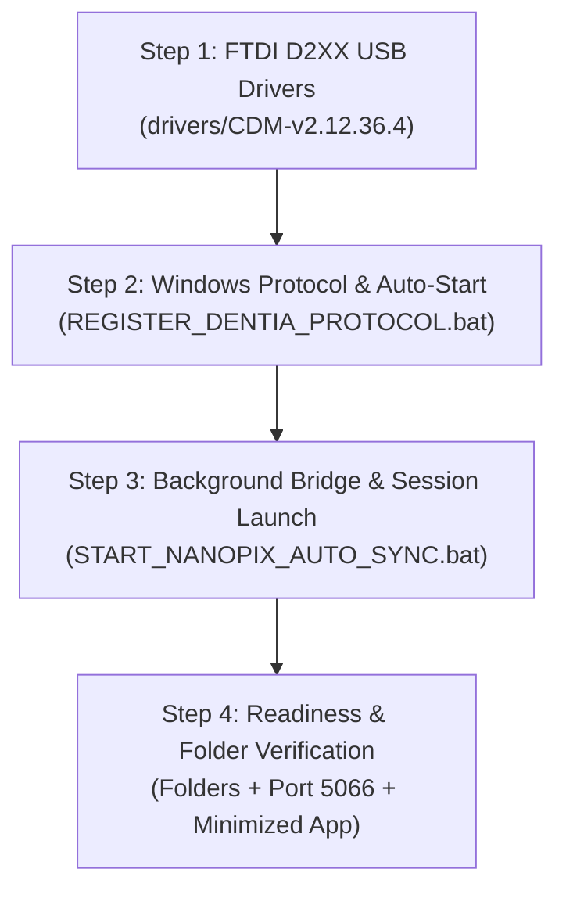

# 🦷 Dentia Hardware Setup, NanoPix Minimize Workflow & Right-Panel Architecture

> **Document Type:** Specification & Architectural Blueprint  
> **Target Audience:** Clinical Users, Frontend/Backend Developers, Support Engineers  
> **Target Applications:** `Dentistfrontend` (Web Cloud/Local) + `NanoPix.exe` + `nanopix_usb_bridge.cjs` (Port 5066)  
> **Status:** Proposed Architecture (Review before implementation)  

---

## 📌 Executive Summary

Based on clinical feedback and workflow review, two essential improvements are required in the Dentia Chairside Hardware interface:

1. **NanoPix Window Handling Instruction (Minimize Warning):**
   - When doctors click the hardware section or trigger sensor acquisition, `NanoPix.exe` opens automatically.
   - **Crucial Requirement:** Doctors must be explicitly instructed to **minimize** the NanoPix window once opened, rather than closing it. The window is required to stay alive in the background for the FTDI D2XX kernel driver and backend bridge communication.

2. **Sequential 4-Step Hardware Installation & Right-Panel Verification:**
   - Currently, the right column of the Hardware Diagnostics modal (`HardwareDeviceSyncBadge.jsx`) is occupied by a generic webcam test, leaving ample unused space for hardware installation diagnostics.
   - **New Requirement:** Replace / reorganize the right panel into a **System Installation & Readiness Inspector**. This panel will:
     - Guide the user through a clear **4-Step Installation Sequence** (Drivers $\rightarrow$ Protocol $\rightarrow$ Bridge $\rightarrow$ Verification).
     - Display live status badges confirming that all **required BAT files** have executed properly.
     - Display live verification that all **required storage folders** (`PatientData`, `nanopix_scans`, `drivers/eighteeth_engine`, Windows Startup scripts) are created and ready.

---

## 🖥️ 1. NanoPix Window Minimize Instruction Flow

### 1.1 The Technical Context
`NanoPix.exe` (Eighteeth v1.1.1.9) utilizes Dear ImGui and an OpenGL GLFW30 runtime. It holds the active direct communication handle to the Eighteeth RVG sensor through the FTDI USB bus. 

If a doctor clicks the red **"X" (Close)** button on the NanoPix desktop window:
- The FTDI USB connection drops.
- Subsequent X-ray tube exposures cannot be captured into Dentia.
- The cloud web app loses hardware synchronization.

### 1.2 User Experience & UI Placement
To prevent accidental closure by doctors, the following prominent UI notices will be incorporated:

```
┌────────────────────────────────────────────────────────────────────────────────────────┐
│  ⚠️ IMPORTANT: PLEASE MINIMIZE THE NANOPIX WINDOW (DO NOT CLOSE)                       │
│  The Eighteeth NanoPix desktop window has opened in the background.                   │
│  👉 Click Minimize [—] to keep it active.                                             │
│  🚫 Do NOT click Close [X] — it must stay running in the background for live X-rays.  │
└────────────────────────────────────────────────────────────────────────────────────────┘
```

#### Planned UI Components for this Notice:
1. **Modal Header Alert Banner (`HardwareDeviceSyncBadge.jsx`):**
   - A bright amber/sky alert box appears whenever `NanoPix.exe` is launched or active.
   - Includes a visual graphic of the Windows minimize icon `[—]` vs close icon `[✕]`.
2. **Launch Button Feedback:**
   - When clicking **"Launch Eighteeth App"**, an animated badge updates: *"Launched! Please minimize the window to your taskbar."*
3. **Setup Guide Page (`NanoPixSetupGuide.jsx`):**
   - Highlighted in Step 3 & 4 with screenshots and clear clinical operational instructions.

---

## 🛠️ 2. The 4-Step Hardware Installation Sequence

To provide doctors and clinic IT technicians with a clear, foolproof installation roadmap, the process is structured into 4 sequential steps:



### Detailed Breakdown of the 4 Steps:

| Step | Action | Files / Commands Involved | Expected Verification Result |
| :--- | :--- | :--- | :--- |
| **Step 1: Driver Setup** | Install FTDI D2XX USB Driver | `drivers\FTDI\` or WHQL Certified Installer | `FT232H VID: 0x0403, PID: 0x6014` detected in Windows Device Manager |
| **Step 2: Protocol & Startup** | 1-Click Protocol Registration | [`REGISTER_DENTIA_PROTOCOL.bat`](file:///d:/dentistfrontend/Dentistfrontend/REGISTER_DENTIA_PROTOCOL.bat) | `dentia-hw://` protocol in Registry & `DentiaNanoPixBridge.vbs` in Windows Startup |
| **Step 3: Bridge Activation** | Launch Bridge & Engine | [`START_NANOPIX_AUTO_SYNC.bat`](file:///d:/dentistfrontend/Dentistfrontend/START_NANOPIX_AUTO_SYNC.bat) or Protocol Link | Bridge HTTP/SSE active on `127.0.0.1:5066`, `NanoPix.exe` launched |
| **Step 4: Folder & Pipeline Audit** | Verify Storage Folders & Sensor Arming | Bridge auto-creation of folders & arm test | All required folders exist, sensor status is **🟢 Armed & Ready** |

---

## 📐 3. Right-Side Panel Redesign (`HardwareDeviceSyncBadge.jsx`)

### 3.1 Problem with Current Layout
In the current modal:
- **Left Column:** Hardware status, bridge health check, connection summary.
- **Right Column:** Contains a large video element for **Webcam Hardware Test** (which takes up ~50% of the modal screen) and a basic USB list.
- **Deficiency:** Dental practices using intraoral digital sensors (RVG) rarely need an active laptop webcam preview dominating half of their diagnostic modal. There is ample room to convert the right column into an authoritative **Installation & File/Folder Verification Dashboard**.

### 3.2 Proposed New 2-Column Modal Layout

```
┌────────────────────────────────────────────────────────────────────────────────────────────────────────┐
│ 🦷 Chairside Hardware Diagnostics                                       [Setup Guide]  [✕ Close]       │
├────────────────────────────────────────────────────────────────────────────────────────────────────────┤
│ ⚠️ ATTENTION: After launching NanoPix, please MINIMIZE [—] the window. Do NOT close [✕] it!            │
├──────────────────────────────────────────────────┬─────────────────────────────────────────────────────┤
│ ── LEFT PANEL: Live Bridge & Sensor Diagnostics ─│ ── RIGHT PANEL: Installation & Environment Verifier │
│                                                  │                                                     │
│ 🟢 Bridge Status: Active on Port 5066            │ 📋 STEP-BY-STEP INSTALLATION CHECKLIST              │
│ 🟢 Sensor Status: Eighteeth Nano-Pix 2 (Armed)   │   [✓] 1. FTDI D2XX Kernel Driver Installed         │
│ 🟢 NanoPix Engine: Running (PID: 6112)           │   [✓] 2. Windows Protocol (dentia-hw://) Registered │
│                                                  │   [✓] 3. Windows Auto-Startup Script Deployed       │
│ [⚡ Launch Eighteeth App]   [Re-Check Health]    │   [✓] 4. Background Bridge Active (Port 5066)       │
│                                                  │                                                     │
│ 🔌 Connection Summary:                           │ 📁 REQUIRED STORAGE FOLDERS AUDIT                   │
│   • Model: Nano-Pix 2 HD CMOS                    │   [✓] PatientData (D:\PatientData)      [Ready]     │
│   • Serial: iRayC7DB5M40P4                       │   [✓] nanopix_scans (Project Root)      [Ready]     │
│   • Driver: FTDI D2XX Kernel DLL                 │   [✓] drivers/eighteeth_engine/         [Ready]     │
│   • Protocol: Direct USB 2.0 (RVG WebUSB)        │   [✓] Startup VBS Script                [Ready]     │
│                                                  │                                                     │
│ [1-Click Auto-Start Agent (dentia-hw://start)]   │ 🎥 Secondary Test: [Open Webcam Preview ▼]          │
├──────────────────────────────────────────────────┴─────────────────────────────────────────────────────┤
│ ── BOTTOM PIPELINE STEPPER: Step 1 Arm USB ➔ Step 2 Waiting X-Ray ➔ Step 3 Real Data ➔ Step 4 Chart   │
└────────────────────────────────────────────────────────────────────────────────────────────────────────┘
```

---

## 📁 4. Files and Folders Verification Matrix

The right-side verification panel will perform live audits on the following specific targets:

### 4.1 Required Batch & Script Files
| File Name | Location | Verification Criterion |
| :--- | :--- | :--- |
| [`REGISTER_DENTIA_PROTOCOL.bat`](file:///d:/dentistfrontend/Dentistfrontend/REGISTER_DENTIA_PROTOCOL.bat) | Root Directory | Registers protocol and copies startup VBS |
| [`START_NANOPIX_AUTO_SYNC.bat`](file:///d:/dentistfrontend/Dentistfrontend/START_NANOPIX_AUTO_SYNC.bat) | Root Directory | Boots engine and node bridge in terminal |
| [`START_AGENT.bat`](file:///d:/dentistfrontend/Dentistfrontend/START_AGENT.bat) | Root Directory | Local port 5055 service runner |
| [`DentiaNanoPixBridge.vbs`](file:///%APPDATA%/Microsoft/Windows/Start%20Menu/Programs/Startup/DentiaNanoPixBridge.vbs) | `%APPDATA%\...\Startup` | Silent Windows boot persistence |
| [`scripts/silent_bridge_launcher.vbs`](file:///d:/dentistfrontend/Dentistfrontend/scripts/silent_bridge_launcher.vbs) | `scripts/` Directory | Invoked by `dentia-hw://start` protocol |

### 4.2 Required Storage Folders
| Folder Path | Purpose | Status Checked |
| :--- | :--- | :--- |
| `D:\PatientData` or `C:\PatientData` | Native Eighteeth Acquisition Export Folder | Auto-detected & watched by bridge |
| `nanopix_scans` | Local repository scan cache | Verified on disk |
| `drivers\eighteeth_engine\1.1.1.9` | Bundled Eighteeth GUI application & DLLs | Confirmed executable present |
| `%USERPROFILE%\Documents\DentiaScans` | Fallback universal user directory | Verified created if missing |

---

## 🔌 5. Backend Telemetry Integration (`/nanopix/status`)

To feed real-time verification data to the right panel without requiring manual doctor input:
1. Extend or utilize the `/nanopix/status` endpoint in [`nanopix_usb_bridge.cjs`](file:///d:/dentistfrontend/Dentistfrontend/nanopix_usb_bridge.cjs) to report:
   ```json
   {
     "bridgeOnline": true,
     "usbConnected": true,
     "eighteethEngine": {
       "running": true,
       "pid": "6112",
       "windowState": "active"
     },
     "installationChecklist": {
       "driverLoaded": true,
       "protocolRegistered": true,
       "startupConfigured": true,
       "bridgeActive": true
     },
     "folderAudit": [
       { "path": "D:\\PatientData", "exists": true, "accessible": true },
       { "path": "nanopix_scans", "exists": true, "accessible": true },
       { "path": "drivers\\eighteeth_engine", "exists": true, "accessible": true }
     ]
   }
   ```
2. In the React frontend (`HardwareDeviceSyncBadge.jsx`), consume this payload to render green checkmarks (`CheckCircle2`) or red warning badges (`AlertCircle`) with action buttons (e.g., *"Create Missing Folder"*, *"Run Register Script"*).

---

## 🚀 6. Next Steps & Implementation Plan

Following your review and approval of this specification:
1. **Frontend Update:**
   - Add the prominent **NanoPix Minimize Instruction Banner** across `HardwareDeviceSyncBadge.jsx` and `NanoPixSetupGuide.jsx`.
   - Redesign the right-hand column of `HardwareDeviceSyncBadge.jsx` into the **Installation & Environment Verification Panel** with 4 steps and folder badges.
   - Retain webcam self-test as an optional accordion/tab dropdown.
2. **Backend Telemetry Update:**
   - Enhance [`nanopix_usb_bridge.cjs`](file:///d:/dentistfrontend/Dentistfrontend/nanopix_usb_bridge.cjs) `/nanopix/status` to return detailed folder verification and BAT file completion telemetry.
3. **Verification:**
   - Validate live rendering in the UI and verify all states (Offline, Initializing, Installed, Armed & Synced).

---
*Created for user review prior to code implementation.*
