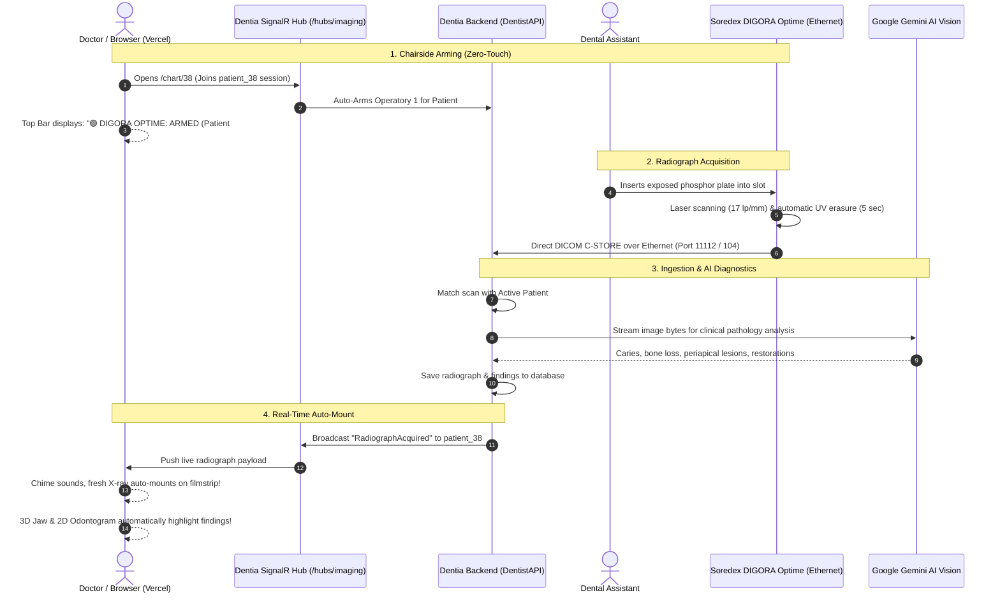

# Soredex DIGORA® Optime Ethernet Integration & Zero-Install Auto-Loading Architecture

> **Target Application**: [Dentia Web Workspace](https://dentistfrontend.vercel.app/dashboard)  
> **Hardware Device**: Soredex DIGORA® Optime (Intraoral Photostimulable Phosphor Plate [PSP] Digital Scanner)  
> **Physical Interface**: 10/100 Mbps RJ-45 Ethernet  
> **Primary Directive**: **100% Zero-Client-Install** — No software, drivers, or agents on doctor workstations/laptops. When a plate is scanned in the DIGORA machine, the radiograph is automatically captured, analyzed by AI, and mounted into the active patient's chart in the web browser.

---

## 1. Executive Summary & Zero-Install Architecture

Traditional dental practice software (e.g. *DIGORA for Windows*, *Scanora*, *DEXIS*, *VixWin*) requires bulky desktop software installations (5+ GB), proprietary USB/Ethernet Windows drivers, local SQL databases, and hardware dongles on every single operatory PC.

Dentia eliminates this entirely through a **Cloud DICOM C-STORE Service & Live Chairside Arming Protocol**.



---

## 2. Technical Analysis: Soredex DIGORA® Optime Ethernet Mechanics

### Hardware & Network Characteristics
1. **Physical Connection**:
   - The DIGORA Optime (DXR-50 / DXR-60) features an onboard **RJ-45 10/100 Mbps Ethernet port**.
   - It connects directly into the clinic's network switch or router using a standard Cat5e/Cat6 patch cable.
   - It is assigned a static IP or DHCP lease on the local clinic subnet (e.g., `192.168.1.50`).
2. **Plate Scanning Cycle**:
   - Accepts intraoral PSP plate sizes: **Size 0** (pediatric), **Size 1**, **Size 2** (standard adult bitewing/periapical), **Size 3** (long bitewing), and **Size 4** (occlusal).
   - Readout time: **4.3 to 7.5 seconds** per plate.
   - Theoretical resolution: **up to 17 lp/mm (16-bit grayscale dynamic range)**.
   - Automatic plate clearing via high-intensity erasing lamp immediately resets the plate for reuse.
3. **Data Transmission Modes**:
   - **DICOM 3.0 Storage SCU (Standard)**: The scanner acts as a DICOM client (`Storage SCU`) and sends a standard `C-STORE-RQ` to the configured Storage SCP (AE Title: `DENTIA_PACS`, Port `11112` or `104`).
   - **Raw TCP Stream Mode**: Legacy Soredex firmware streams 16-bit uncompressed raster frames over raw TCP port `2002` to the configured listening host.

---

## 3. Best Architectural Approaches Compared

| Evaluation Dimension | Approach 1: Direct Cloud DICOM C-STORE (Recommended) | Approach 2: LAN Headless Gateway (Micro-Bridge) | Approach 3: Legacy PC Software (Rejected) |
| :--- | :--- | :--- | :--- |
| **Software on Doctor PC** | **0 bytes (Strict Zero-Install)** | **0 bytes (Strict Zero-Install)** | 5+ GB desktop installation |
| **Doctor Workstation Compatibility** | Any device (MacBook, Windows, iPad, Surface, Linux) | Any device (MacBook, Windows, iPad, Surface, Linux) | Windows 10/11 desktop only |
| **Local Clinic Hardware** | None (Uses existing clinic internet router) | Single $35 micro-appliance (Raspberry Pi or mini router) | Dedicated Windows imaging server |
| **Speed to Doctor Screen** | **< 2.0 seconds** | **< 1.5 seconds** | 10–30 seconds (Manual export & import) |
| **Clinic Maintenance Overhead** | **Zero local maintenance** | Minimal (set and forget) | High (OS updates break drivers, license keys) |

### Recommended Solution:
- **Primary**: **Approach 1 (Direct Cloud DICOM C-STORE)**. In clinics where the internet router supports outbound connections or port forwarding, DIGORA Optime points directly to the Dentia Cloud PACS receiver.
- **Failover**: **Approach 2 (LAN Headless Gateway)**. For legacy DIGORA Optime firmware that cannot traverse external WAN NATs or only speaks port 2002, a single plug-and-play headless micro-service running on the clinic router or reception machine captures the Ethernet stream and forwards it to `https://dentist-api-dev.vitonta.com/api/hardware/digora/ingest`. **The doctor's PC still remains 100% software-free.**

---

## 4. Automatic Patient Assignment: Active Chairside Arming

### The Core Challenge
Phosphor storage plates are passive sensor foils coated with europium-doped barium fluorohalide. Unlike active digital sensors with memory chips, **a phosphor plate contains no embedded patient ID**.

### The Solution: Active Chairside Arming Protocol
Dentia solves this seamlessly without requiring the doctor to type or scan barcodes:

```
[Doctor opens https://dentistfrontend.vercel.app/chart/38]
                      │
                      ▼
[Frontend auto-joins SignalR Hub: /hubs/imaging]
                      │
                      ▼
[Frontend dispatches Arming Request]:
POST /api/hardware/digora/arm
{ "operatoryId": "Op-1", "patientId": 38, "scannerId": "DIGORA_01" }
                      │
                      ▼
[Top Header Badge Turns Green]:
"🟢 DIGORA OPTIME: ARMED FOR PATIENT #38" (10-minute active lease)
                      │
                      ▼
[Assistant feeds plate into DIGORA Optime scanner]
                      │
                      ▼
[DIGORA Optime finishes scan & transmits image via Ethernet]
                      │
                      ▼
[Dentia Backend matches incoming scan with Active Arming Lease]:
-> Found: Patient #38
-> Saves to database as Radiograph record
-> Triggers Gemini AI Vision pathology scan
-> Emits SignalR event: "RadiographAcquired" to room `patient_38`
                      │
                      ▼
[Doctor's screen on Vercel plays subtle audio chime and auto-mounts the radiograph!]
```

### Safety Net: Unassigned Scans Floating Drawer
If an assistant scans a plate when no doctor has that patient's chart open (or if the 10-minute lease expired):
1. The backend stores the radiograph in the **Clinic Unassigned Imaging Queue**.
2. A subtle floating badge illuminates in the top navigation bar of all clinic devices:  
   `🔔 1 Unassigned X-Ray Ready (Size 2 Bitewing · 10:42 AM)`
3. Any doctor can click the notification and tap **"Assign to Current Patient"** with 1 click.

---

## 5. End-to-End Implementation Blueprint

### Phase 1: Backend Implementation (`DentistAPIClone\API_dentist`)

#### 1. Hardware Ingest Controller & Arming Service
Create `HardwareImagingController.cs`:
```csharp
[ApiController]
[Route("api/hardware/digora")]
[EnableCors("AllowAll")]
public class HardwareImagingController : ControllerBase
{
    private readonly DentalRepository _repository;
    private readonly GeminiDentalNotesService _geminiService;
    private readonly IHubContext<ImagingHub> _hubContext;
    private static readonly ConcurrentDictionary<string, ArmedSession> _armedSessions = new();

    public record ArmRequest(string OperatoryId, int PatientId, string ScannerId);
    public record ArmedSession(int PatientId, string OperatoryId, DateTime ArmedAt, TimeSpan Duration);

    [HttpPost("arm")]
    public IActionResult ArmScanner([FromBody] ArmRequest req)
    {
        _armedSessions[req.OperatoryId] = new ArmedSession(req.PatientId, req.OperatoryId, DateTime.UtcNow, TimeSpan.FromMinutes(10));
        return Ok(new { message = $"Operatory {req.OperatoryId} armed for Patient #{req.PatientId} for 10 minutes." });
    }

    [HttpGet("status/{operatoryId}")]
    public IActionResult GetStatus(string operatoryId)
    {
        if (_armedSessions.TryGetValue(operatoryId, out var session) && (DateTime.UtcNow - session.ArmedAt) < session.Duration)
        {
            return Ok(new { armed = true, patientId = session.PatientId, remainingSeconds = (session.Duration - (DateTime.UtcNow - session.ArmedAt)).TotalSeconds });
        }
        return Ok(new { armed = false, patientId = (int?)null });
    }

    [HttpPost("ingest")]
    [Consumes("multipart/form-data")]
    public async Task<IActionResult> IngestScan([FromForm] IFormFile file, [FromQuery] string operatoryId = "Op-1")
    {
        // 1. Resolve armed patient
        int? targetPatientId = null;
        if (_armedSessions.TryGetValue(operatoryId, out var session) && (DateTime.UtcNow - session.ArmedAt) < session.Duration)
        {
            targetPatientId = session.PatientId;
        }

        using var ms = new MemoryStream();
        await file.CopyToAsync(ms);
        byte[] rawBytes = ms.ToArray();

        // 2. AI Pathology Scan via Gemini
        string analysis = await _geminiService.AnalyzeRadiographAsync(rawBytes, file.ContentType ?? "image/png");

        // 3. Save Radiograph
        var radiograph = new Radiograph
        {
            PatientID = targetPatientId ?? 0, // 0 = unassigned tray
            ImageName = $"DIGORA_{DateTime.UtcNow:yyyyMMdd_HHmmss}.png",
            MimeType = file.ContentType ?? "image/png",
            ImageData = rawBytes,
            AnalysisSummary = analysis
        };
        int id = await _repository.AddRadiographAsync(radiograph);

        // 4. Real-Time SignalR Broadcast
        if (targetPatientId.HasValue && targetPatientId.Value > 0)
        {
            await _hubContext.Clients.Group($"patient_{targetPatientId.Value}").SendAsync("RadiographAcquired", new
            {
                RadiographID = id,
                PatientID = targetPatientId.Value,
                ImageName = radiograph.ImageName,
                UploadedAt = DateTime.UtcNow,
                AnalysisSummary = analysis,
                Source = "Soredex DIGORA Optime Ethernet"
            });
        }
        else
        {
            await _hubContext.Clients.All.SendAsync("UnassignedScanAvailable", new { RadiographID = id, UploadedAt = DateTime.UtcNow });
        }

        return Ok(new { RadiographID = id, AssignedPatientID = targetPatientId, Status = "SUCCESS" });
    }
}
```

#### 2. SignalR Hub Notification Hook in `RadiographsController.cs`
Update existing `UploadRadiograph` method in `RadiographsController.cs` to inject `IHubContext<ImagingHub>` so any manual or hardware upload instantly broadcasts `RadiographAcquired` to the open patient session.

---

### Phase 2: Frontend Real-Time Client (`Dentistfrontend` on Vercel)

#### 1. Real-Time Hardware Sync Hook (`useDigoraHardwareSync.js`)
```javascript
import { useEffect, useState } from 'react';
import * as signalR from '@microsoft/signalr';

export function useDigoraHardwareSync(patientId, onRadiographAcquired) {
  const [connectionState, setConnectionState] = useState('Disconnected');
  const [isArmed, setIsArmed] = useState(false);

  useEffect(() => {
    if (!patientId) return;

    const connection = new signalR.HubConnectionBuilder()
      .withUrl('https://dentist-api-dev.vitonta.com/hubs/imaging', {
        skipNegotiation: false,
        transport: signalR.HttpTransportType.WebSockets | signalR.HttpTransportType.LongPolling
      })
      .withAutomaticReconnect([0, 2000, 5000, 10000])
      .build();

    connection.start()
      .then(() => {
        setConnectionState('Connected');
        connection.invoke('JoinPatientSession', String(patientId));
        
        // Auto-Arm scanner for this patient
        fetch('https://dentist-api-dev.vitonta.com/api/hardware/digora/arm', {
          method: 'POST',
          headers: { 'Content-Type': 'application/json' },
          body: JSON.stringify({ operatoryId: 'Op-1', patientId: Number(patientId), scannerId: 'DIGORA_01' })
        }).then(() => setIsArmed(true));
      })
      .catch(err => console.error('SignalR Hub Connection Error:', err));

    connection.on('RadiographAcquired', (scanData) => {
      // Audio chime notification
      try {
        const audio = new Audio('/sounds/scan-acquired.mp3');
        audio.play().catch(() => {});
      } catch (e) {}

      if (onRadiographAcquired) {
        onRadiographAcquired(scanData);
      }
    });

    return () => {
      if (connection) {
        connection.invoke('LeavePatientSession', String(patientId)).catch(() => {});
        connection.stop();
      }
    };
  }, [patientId]);

  return { connectionState, isArmed };
}
```

#### 2. Chart Integration in `ChartPage.jsx` & `ChartRadiographFilmstrip.jsx`
- Add live hardware arming pill in the header:
  - `🟢 DIGORA OPTIME: ARMED FOR PATIENT #38`
  - Allows manual re-arming or switching operatory rooms with 1 click.
- When `RadiographAcquired` fires:
  - Prepend the new radiograph directly to `radiographs` state.
  - Set `selectedRadiograph` to the incoming scan.
  - Automatically spotlight AI-detected teeth on the 3D Jaw Arch and 2D Odontogram.
  - Show a celebratory toast: `"✨ Radiograph acquired from DIGORA Optime and loaded for Patient #38!"`.

---

## 6. Soredex DIGORA® Optime Ethernet Setup Guide (One-Time 5 Min Setup)

### Physical Network Setup:
1. Connect an Ethernet cable from the RJ-45 jack on the back of the DIGORA Optime to your clinic's Gigabit switch or router.
2. Power on the DIGORA Optime. The front display will show `READY`.

### Network & DICOM Configuration:
Through the DIGORA Optime Web Management Interface or Soredex Service Tool:

| Setting Parameter | Value to Enter |
| :--- | :--- |
| **Scanner IP Configuration** | Static IP (e.g. `192.168.1.50`) or DHCP |
| **Subnet Mask** | `255.255.255.0` |
| **Default Gateway** | Clinic Router IP (e.g. `192.168.1.1`) |
| **Storage SCP (PACS) IP / Host** | Cloud Host or Clinic Gateway IP |
| **Storage SCP Port** | `11112` (or `104`) |
| **Called AE Title** | `DENTIA_PACS` |
| **Calling AE Title** | `DIGORA_OPTIME` |

---

## 7. Verification & Clinical Workflow Walkthrough

1. **Step 1 — Doctor**: Doctor logs into `https://dentistfrontend.vercel.app/chart/38`.
2. **Step 2 — Status**: Top bar confirms: `🟢 DIGORA OPTIME: ARMED (Patient #38)`.
3. **Step 3 — Assistant**: Takes standard intraoral radiograph with phosphor plate; drops plate into DIGORA Optime slot.
4. **Step 4 — Hardware**: Machine processes plate in 5 seconds, erases it, and transmits file over Ethernet.
5. **Step 5 — Web Browser**: Patient #38's chart instantly displays the high-resolution radiograph, highlights diagnosed teeth on the 3D Jaw, and presents the AI diagnostic report!
6. **Result**: **0 bytes installed on doctor's PC. 100% automated chairside workflow.**
