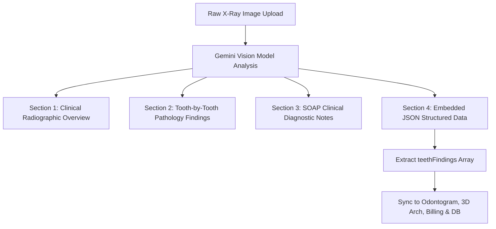
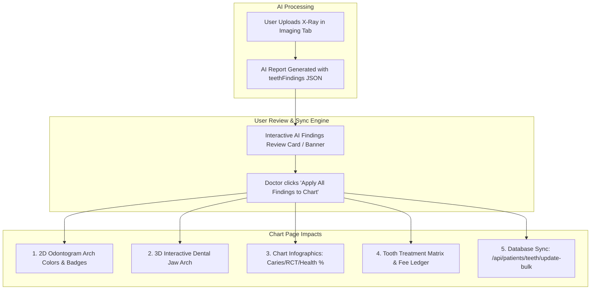

# AI Radiographic Diagnostics to Dental Chart Sync Architecture

## 1. Executive Summary & Objective

When a clinician uploads a patient dental radiograph (OPG, Bitewing, Periapical RVG) in the **Imaging & X-Rays** tab (`activeTab === 'radiographs'`), an AI vision engine (Google Gemini Vision 2.5 Flash / Groq Vision) analyzes the radiograph. 

Currently, the analysis report text is saved in the `[dentist].[radiographs]` table and displayed inside a collapsible markdown viewer. However, the detected pathologies (e.g., Caries, Periapical Radiolucency, Impactions, Bone Loss) do not automatically propagate to the patient's **Dental Chart (Odontogram)**, **3D Jaw View**, **Infographics KPIs**, or the **Treatment Matrix & Billing tab**.

This architecture defines the end-to-end mechanism to parse AI radiograph reports, extract structured tooth-level findings, and apply them across the entire Chart Page with clinician review and database persistence.

---

## 2. AI Radiograph Analysis Report Structure

When an image is submitted to `/api/patients/{patientId}/radiographs`, the backend `GeminiDentalNotesService.AnalyzeRadiographAsync` generates a comprehensive, standardized 4-part clinical document:



### 2.1 The 4 Report Sections Generated by AI

1. **Section 1: Clinical Radiographic Overview**
   - Modality identification: Periapical (RVG), Bitewing, or Panoramic (OPG).
   - Anatomical landmarks, alveolar crest height, crown-to-root ratios, lamina dura integrity, and periodontal ligament space.

2. **Section 2: Tooth-by-Tooth Findings & Pathology**
   - Identifies all visible teeth using Universal Numbering (1–32) or Pediatric (A–T).
   - Classifies pathologies:
     - **Dental Caries:** Interproximal, occlusal, recurrent, or cervical.
     - **Periapical Radiolucency:** Apical periodontitis, granuloma, or cyst.
     - **Periodontal Bone Loss:** Horizontal/vertical bone loss, furcation involvement.
     - **Prosthetic / Restorative Status:** Intact vs defective margins, overhangs, endodontic obturation quality.
     - **Impactions & Eruption:** Completely bony, soft tissue impaction, ectopic path.
   - Assigns severity (Incipient, Moderate, Severe) and diagnostic confidence percentage.

3. **Section 3: Comprehensive SOAP Clinical Notes**
   - **Subjective:** Patient presentation & diagnostic indication for imaging.
   - **Objective:** Detailed radiographic observations and bone architecture.
   - **Assessment:** Definitive clinical diagnoses per tooth.
   - **Plan:** Recommended clinical treatments with official ADA CDT procedure codes (e.g., D2391, D3330, D4341, D7240).

4. **Section 4: Machine-Readable Structured JSON Block (`teethFindings`)**
   Embedded at the conclusion of every report inside a ` ```json ` block:

```json
{
  "teethFindings": [
    {
      "toothNumber": 19,
      "toothKey": "19",
      "condition": "Periapical Radiolucency",
      "severity": "Moderate lesion",
      "confidence": 95,
      "color": "#DC2626",
      "cdtCode": "D3330",
      "procedure": "CDT D3330 (Molar Endodontic Root Canal Therapy)",
      "surface": "Apical",
      "status": "Planned"
    },
    {
      "toothNumber": 14,
      "toothKey": "14",
      "condition": "Dental Caries — Interproximal (MO)",
      "severity": "Dentin involvement",
      "confidence": 92,
      "color": "#EF4444",
      "cdtCode": "D2392",
      "procedure": "CDT D2392 (Resin Composite - 2 Surfaces Posterior)",
      "surface": "MO",
      "status": "Planned"
    }
  ],
  "soap": {
    "subjective": "Routine diagnostic radiograph evaluation.",
    "objective": "Periapical radiolucency noted at the mesial apex of tooth #19. Radiopacity consistent with dentinal demineralization on mesial-occlusal surface of tooth #14.",
    "assessment": "Tooth #19: Symptomatic apical periodontitis. Tooth #14: Enamel-dentinal caries.",
    "plan": "Tooth #19: Endodontic therapy (D3330). Tooth #14: 2-surface composite restoration (D2392)."
  },
  "primaryTooth": 19
}
```

---

## 3. Impact & Propagation Across the Chart Page

Once findings are extracted from the uploaded X-Ray report, they propagate into **5 distinct systems** of the Chart Page:

| Subsystem | Impact & Effect | Visual Indicator |
| :--- | :--- | :--- |
| **1. 2D Odontogram Arch** | Tooth visual color changes according to pathology; condition label, surfaces, and AI badge are applied. | Tooth circle/crown changes to `#DC2626` (Red) or `#EF4444`; ✨ AI badge displayed. |
| **2. 3D Interactive Jaw** | Meshes for affected tooth numbers update their shader color and emissive glow. | Dynamic highlight in 3D Three.js canvas matching tooth condition color. |
| **3. Infographics & KPIs** | Caries count, RCT count, and Healthy percentage recalculate immediately. | Top progress bars and pathology counters update (e.g. Caries: 2, RCT: 1). |
| **4. Tooth Treatment Matrix & Billing** | Tooth is added to the treatment table with condition, CDT code, standard fee, and `Planned` status. | Appears in Treatment Matrix table and unbilled care totals (`Rs 50,000`). |
| **5. Database Persistence** | Sent to backend `[dentist].[patient_teeth]` and `[dentist].[treatments]` via `/api/patients/teeth/update-bulk`. | Persisted across page refreshes and multi-user clinic terminals. |



---

## 4. UI / UX Workflow & Components

### 4.1 Automated Finding Extraction
A lightweight client-side extraction helper `extractAiFindingsFromReport(reportText)` safely checks for:
1. Valid embedded JSON code blocks (` ```json ... ``` `).
2. Fallback regex extraction looking for patterns like `#19: Caries`, `Tooth #14: Radiolucency`, and CDT codes (`D3330`, `D2391`).
3. Standard clinical color mapping via `getHexColor(condition)`.

### 4.2 The "AI Diagnostic Findings" Action Banner
Inside the **Imaging & X-Rays** tab (directly beneath the upload card and above the radiograph viewer):
- Whenever a radiograph with findings is uploaded or selected, an **AI Findings Review Card** appears:
  - Header: `✨ AI Detected 2 Pathological Findings in this Radiograph`
  - Itemized pills:
    - `[Tooth #19]` • `Periapical Radiolucency` • `CDT D3330` • `95% Confidence`
    - `[Tooth #14]` • `Dental Caries (MO)` • `CDT D2392` • `92% Confidence`
  - Action Buttons:
    - **`[ Apply All Findings to Dental Chart ]`** (Primary green/blue action).
    - **`[ View on Odontogram ➔ ]`** (Switches tab to `'chart'`).
    - **`[ Review in Treatment Matrix ➔ ]`** (Switches tab to `'billing'`).
  - Status indicator: Shows `"✓ Applied to Patient Chart"` if already synced.

### 4.3 Instant Bulk Sync Handler (`handleApplyAiFindingsToChart`)
When triggered (either automatically on upload completion or via the "Apply" button):
1. Maps each finding into the standardized `update-bulk` payload:
   ```js
   {
     patientId: Number(patientId),
     updates: findings.map(f => ({
       toothNumber: f.toothNumber,
       toothKey: String(f.toothNumber),
       conditionStatus: f.condition,
       condition: f.condition,
       color: f.color || getHexColor(f.condition),
       status: f.status || 'Planned',
       cdtCode: f.cdtCode || '',
       comment: `[AI X-Ray Finding] ${f.condition} (${f.confidence}% conf). Procedure: ${f.procedure || f.cdtCode}`,
       doctorId: currentDoctorId
     }))
   }
   ```
2. Updates local `teethState` immediately with functional React state update `setTeethState(prev => ...)`.
3. Sends `POST /api/patients/teeth/update-bulk` to persist in SQL database.
4. Triggers interactive toast notification:
   `"✨ AI findings applied to Teeth #19, #14! Chart and billing updated."`

---

## 5. Security, Validation & Doctor Override

1. **Doctor Autonomy & Safety:**
   - AI findings are tagged as `status: 'Planned'` (never marked as `'Completed'` without clinical intervention).
   - Doctor can override, modify condition, change CDT code, or delete the finding at any time via the Odontogram popup or Treatment Matrix edit button.
2. **Pediatric & Permanent Dentition Compatibility:**
   - Supports both adult Universal Numbering (1–32) and pediatric letter notations (A–T).
3. **Idempotency:**
   - Applying findings updates existing records for that tooth without creating duplicate teeth rows.

---

## 6. Implementation Checklist

- [ ] Add `extractAiFindingsFromReport(reportText)` parser utility to `ChartPage.jsx` and `RadiologyReportViewer.jsx`.
- [ ] Implement `handleApplyAiFindingsToChart(findings, radiograph)` in `ChartPage.jsx`.
- [ ] Add the interactive **AI Radiographic Findings Action Banner** in the `Imaging & X-Rays` tab right beside/under the uploaded radiograph.
- [ ] Enable automatic sync option with instant toast feedback upon successful scan upload.
- [ ] Connect `update-bulk` API call so database `[patient_teeth]` and `[treatments]` tables are synchronized.
- [ ] Mirror changes to `Dentistfrontend` and build with `npm run build`.
